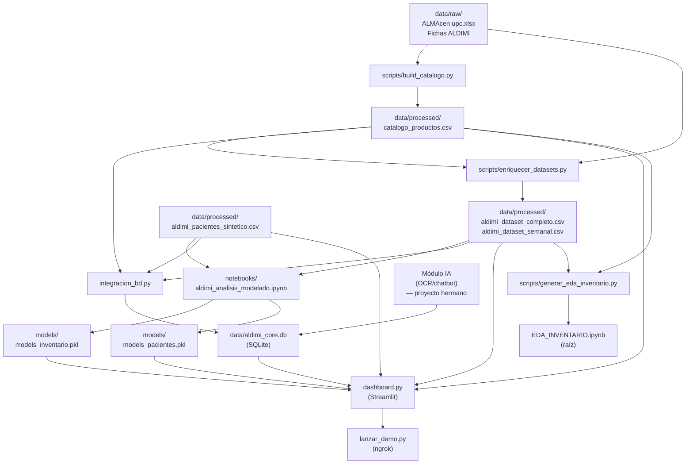

# Análisis Arquitectónico — ALDIMI Predict
**Machine Learning 1ACC0057 · UPC · Julio 2026**

---

## 1. Visión general del proyecto

**ALDIMI Predict** es una aplicación web de Machine Learning para el **Albergue Divina Misericordia (ALDIMI)**, un albergue oncológico pediátrico en Lima. El sistema resuelve dos problemas operativos reales:

1. **Predicción de desabastecimiento de inventario**: alerta cuándo un producto del almacén se agotará en los próximos 7 o 14 días.
2. **Clasificación de riesgo de pacientes**: prioriza qué niños necesitan atención primero (Alto / Medio / Bajo).

La aplicación está construida sobre **Streamlit** (interfaz web), **scikit-learn / XGBoost** (modelos ML), **SQLite** (base de datos compartida con el módulo de IA del proyecto hermano), y corre en Python 3.10.

---

## 2. Árbol de directorios actual (estado real)

```
TB1/                                        ← Raíz del proyecto
│
├── dashboard.py                            ★ Aplicación principal (Streamlit)
├── integracion_bd.py                       ★ Utilidad: CSV → SQLite
├── lanzar_demo.py                          ★ Demo pública vía ngrok
├── requirements.txt                        ★ Dependencias
├── README.md                               ★ Documentación de uso
├── .gitignore
├── .ngrok_token                            ⚠ Secreto (no versionar)
│
├── data/                                   ★ Datos del proyecto
│   ├── aldimi_core.db                      ★ BD SQLite (confluencia IA↔ML)
│   ├── raw/                                ★ Datos originales del albergue
│   │   ├── ALMAcen upc.xlsx
│   │   ├── Ficha de Ingreso -Pacientes ALDIMI 2026.docx
│   │   └── FORMATO DE REINGRESO...docx
│   └── processed/                          ★ Datasets listos para uso
│       ├── catalogo_productos.csv
│       ├── aldimi_dataset_completo.csv
│       ├── aldimi_dataset_semanal.csv
│       └── aldimi_pacientes_sintetico.csv
│
├── models/                                 ★ Modelos ML entrenados
│   ├── models_inventario.pkl               (XGBoost 7d + RF 14d + scaler + LE)
│   └── models_pacientes.pkl               (XGBoost multiclase + scaler)
│
├── scripts/                                ★ Pipeline de datos (off-line)
│   ├── build_catalogo.py                   (1) Genera catalogo_productos.csv
│   ├── enriquecer_datasets.py              (2) Enriquece datasets con catálogo
│   └── generar_eda_inventario.py           (3) Genera EDA_INVENTARIO.ipynb en raíz
│
├── notebooks/                              ★ Análisis y entrenamiento
│   └── aldimi_analisis_modelado.ipynb      Notebook de entrenamiento completo
│
├── figures/                                ★ Gráficas exportadas
│   ├── hito2/    (g1–g12, EDA + baseline)
│   └── hito3/    (fig13–fig17, modelado avanzado)
│
├── Informe/                                ★ Documentación académica
│   ├── TF_ALDIMI_v6.tex                    Fuente LaTeX del informe final
│   ├── TF_ALDIMI_v6.pdf                    Informe final compilado
│   ├── TF_secciones_nuevas.tex             Secciones intermedias (integradas en v6)
│   ├── TB1_ALDIMI_v5.tex / .pdf / .docx    Versión anterior
│   ├── TB1_ALDIMI_v5.aux/.log/.out/.toc    ⚠ Artefactos LaTeX (eliminables)
│   ├── manual_usuario_ALDIMI.docx
│   ├── diccionario_datos_ALDIMI.xlsx
│   ├── guion_exposicion_hito2.md
│   ├── guion_video_y_exposicion_hito4.md
│   ├── TP-TF-1ASI0404-Enunciado - 2026-10 (2).pdf
│   └── versiones/                          Borradores previos (v2, v3, v4)
│       ├── TB1_ALDIMI_v2.docx
│       ├── TB1_ALDIMI_v3.docx
│       ├── TB1_ALDIMI_v4.docx
│       └── TP_1ASI404_3037_GRUPO_2.docx
│
├── entrega/                                ⚠ Paquete de entrega (casi todo duplicado)
│   ├── TF_1ASI404_3037_GRUPO_02.zip
│   └── TF_1ASI404_3037_GRUPO_02/
│       ├── codigo/     (≈ raíz del proyecto)
│       ├── datos/      (≈ data/processed/ + aldimi_core.db)
│       └── docs/       (≈ subset de Informe/)
│
│── EDA_INVENTARIO.ipynb                    ⚠ Generado por scripts/ (duplicado)
├── EDA_Alimentos.ipynb                     ⚠ Exploración temprana (otro dataset)
├── EDA_LEUCEMIA.ipynb                      ⚠ Exploración temprana (otro dataset)
│
├── data_aldimi/                            ✖ DUPLICADO EXACTO de data/raw/
├── data_nueva/                             ✖ Versión obsoleta de data/processed/
├── Doc/                                    ✖ Carpeta vacía
├── archivos/                               ✖ RARs de respaldo (154 MB, sin uso)
│   ├── Dashboard.rar
│   ├── DataAldimi.rar
│   └── Datasets.rar
│
└── __pycache__/                            ✖ Cache Python (auto-generado)
    └── dashboard.cpython-310.pyc
```

Leyenda: `★` = activo y necesario · `⚠` = requiere revisión · `✖` = candidato a eliminar

---

## 3. Archivos y carpetas candidatos a eliminación

### 3.1 Eliminación segura (sin riesgo)

| Elemento | Tamaño | Motivo |
|---|---|---|
| `data_aldimi/` | 256 KB | **Duplicado exacto** de `data/raw/`. Confirmado con `diff -rq`: sin diferencias. |
| `data_nueva/` | 512 KB | Versión **obsoleta** de `data/processed/`. Mismas filas pero sin las columnas `catalogo_productos` (nombre, unidad, categoría general). `data/processed/` es la versión enriquecida y canónica. |
| `Doc/` | 0 B | **Carpeta vacía**. Sin contenido ni referencia en ningún archivo. |
| `__pycache__/` | ~34 KB | Cache Python **auto-generado** al ejecutar `dashboard.py`. Git ya lo ignora (`.gitignore`). Se regenera solo. |
| `Informe/TB1_ALDIMI_v5.aux` | — | **Artefacto LaTeX** generado al compilar. Se regenera con `xelatex`. |
| `Informe/TB1_ALDIMI_v5.log` | — | Log de compilación LaTeX. Se regenera. |
| `Informe/TB1_ALDIMI_v5.out` | — | Artefacto LaTeX (hyperref). Se regenera. |
| `Informe/TB1_ALDIMI_v5.toc` | — | Tabla de contenidos LaTeX. Se regenera. |

### 3.2 Candidatos a archivar o consolidar (decisión del equipo)

| Elemento | Tamaño | Motivo |
|---|---|---|
| `archivos/` | **154 MB** | RARs de respaldo (`Dashboard.rar`, `DataAldimi.rar`, `Datasets.rar`). No referenciados en ningún `.py` ni `.md`. El código está en `dashboard.py`, los datos en `data/`. Mantenerlos infla el repo significativamente. Recomendación: eliminar del repo y conservar en almacenamiento externo si son necesarios. |
| `EDA_Alimentos.ipynb` | 651 KB | Exploración de **un dataset de alimentos genérico**, no relacionado con ALDIMI. No referenciado en ningún archivo. Es un artefacto del hito temprano. Mover a `archive/` o eliminar. |
| `EDA_LEUCEMIA.ipynb` | 966 KB | Exploración de **un dataset público de leucemia** (Kaggle u similar), no es el dato real de ALDIMI. Mismo caso. Mover a `archive/` o eliminar. |
| `EDA_INVENTARIO.ipynb` (raíz) | 706 KB | **Generado automáticamente** por `scripts/generar_eda_inventario.py`. Su copia en `entrega/codigo/notebooks/EDA_INVENTARIO.ipynb` es idéntica. El notebook funcional debe vivir en `notebooks/`, no en la raíz. Ver sección 5. |
| `entrega/TF_1ASI404_3037_GRUPO_02/` | ~18 MB | El **directorio descomprimido** dentro de `entrega/` es casi idéntico al proyecto raíz. El ZIP (`TF_1ASI404_3037_GRUPO_02.zip`) ya lo contiene todo. Mantener solo el ZIP para no duplicar 18 MB. |
| `Informe/TF_secciones_nuevas.tex` | — | Secciones intermedias del hito 4 que ya están integradas en `TF_ALDIMI_v6.tex`. Mover a `versiones/` como referencia. |
| `Informe/TB1_ALDIMI_v5.docx` | — | Versión Word de la v5 (anterior a la final). Mover a `Informe/versiones/`. |

### 3.3 Archivo con bug pendiente

| Elemento | Problema | Solución |
|---|---|---|
| `entrega/.../scripts/enriquecer_datasets.py` | Truncado: termina en `if __name__ == "__main__"` sin los dos puntos ni la llamada a `main()`. La versión en `scripts/` de la raíz está corregida. | Si se regenera el ZIP de entrega, copiar la versión corregida del raíz. |

---

## 4. Arquitectura del sistema

### 4.1 Patrón arquitectónico

El proyecto sigue un patrón **Pipeline de datos + Aplicación monolítica**, cercano a un **ETL → Train → Serve**:

```
[ Datos brutos ]
      │
      ▼  scripts/build_catalogo.py
[ Catálogo maestro ]
      │
      ▼  scripts/enriquecer_datasets.py
[ Datasets procesados (CSV) ]
      │
      ▼  notebooks/aldimi_analisis_modelado.ipynb
[ Modelos entrenados (.pkl) ]
      │
      ├─────────────────────────────────┐
      ▼                                 ▼
[ data/processed/ ]             [ models/ ]
      │                                 │
      └──────────────┬──────────────────┘
                     ▼
              [ dashboard.py ]   ←──── [ data/aldimi_core.db ]
                     │                        ▲
                     ▼                        │
              [ Usuario final ]    [ módulo IA (OCR/chatbot) ]
```

### 4.2 Diagrama de dependencias (Mermaid)



---

## 5. Análisis detallado de cada componente

### 5.1 `dashboard.py` — Aplicación principal

**Función:** Interfaz web completa del sistema. Es el único punto de entrada para el usuario final.

**Responsabilidad:** Integra carga de datos, inferencia de modelos y visualización en una sola aplicación Streamlit de ~800 líneas. Implementa tres vistas:
- **Inicio**: KPIs accionables (productos agotados, pacientes de alta prioridad).
- **Inventario y reposición**: plan de reposición semanal, consulta individual por producto, evolución histórica del stock.
- **Pacientes y prioridad**: formulario de evaluación de un nuevo paciente, tabla de pacientes de alta prioridad, distribución general.

**Dependencias (lo que necesita):**
- `data/aldimi_core.db` (preferido) o `data/processed/*.csv` (fallback)
- `models/models_inventario.pkl`
- `models/models_pacientes.pkl`
- Librerías: `streamlit`, `pandas`, `numpy`, `plotly`, `joblib`

**Dependientes (qué lo usa):**
- `lanzar_demo.py` lo lanza como subproceso
- El usuario lo ejecuta directamente con `streamlit run dashboard.py`

**Comunicación con el resto:**
- Lee datos con `sqlite3` o `pd.read_csv()` en función de si existe la BD
- Carga modelos con `joblib.load()`
- Expone métricas del modelo en sidebar (F1, AUC) mediante datos almacenados dentro de los propios `.pkl`
- Utiliza `@st.cache_data` y `@st.cache_resource` para no recargar datos ni modelos en cada interacción

**Flujo de ejecución:**
```
streamlit run dashboard.py
    │
    ├─ Configuración de página (set_page_config)
    ├─ Definición de paleta y helpers de estilo
    ├─ CSS global (st.markdown + unsafe_allow_html)
    │
    ├─ cargar_datos()          ← intenta BD, fallback CSV
    │       └─ @st.cache_data (se ejecuta solo la primera vez)
    ├─ cargar_modelos()        ← joblib.load de los dos .pkl
    │       └─ @st.cache_resource
    │
    ├─ plan_reposicion()       ← inferencia batch sobre última semana
    │       └─ @st.cache_data
    │
    ├─ Sidebar (navegación, resumen, acerca de)
    │
    └─ Condicional de página:
          ├─ "Inicio"         → KPIs + acciones + gráficas contexto
          ├─ "Inventario"     → tabla plan + consulta individual + evolución
          └─ "Pacientes"      → formulario + inferencia online + tabla alta prioridad
```

**Impacto si se modifica o elimina:**
- Si se elimina: el sistema queda sin interfaz. Es el componente crítico.
- Si se modifica la ruta de `data/` o `models/`: las funciones `cargar_datos()` y `cargar_modelos()` fallarán con `FileNotFoundError`.
- Si se añaden columnas a los CSV: hay que actualizar los nombres de columnas referenciados en el código (e.g., `'nivel_riesgo'`, `'rolling_avg_salidas_3sem'`).

---

### 5.2 `integracion_bd.py` — Puente CSV → SQLite

**Función:** Crea y actualiza `data/aldimi_core.db` (SQLite) cargando los cuatro CSV procesados.

**Responsabilidad:** Es el punto de confluencia entre este módulo ML y el módulo de IA (OCR/chatbot) del proyecto hermano. El módulo de IA inserta registros en las tablas `pacientes` e `inventario_semanal`; este script inicializa la BD con los datos históricos.

**Dependencias:**
- `data/processed/aldimi_dataset_semanal.csv`
- `data/processed/aldimi_dataset_completo.csv`
- `data/processed/catalogo_productos.csv`
- `data/processed/aldimi_pacientes_sintetico.csv`

**Dependientes:** `dashboard.py` lee de `data/aldimi_core.db` si existe.

**Tablas que crea:**
```sql
inventario_semanal  ← aldimi_dataset_semanal.csv
articulos           ← aldimi_dataset_completo.csv
catalogo_productos  ← catalogo_productos.csv
pacientes           ← aldimi_pacientes_sintetico.csv
sync_log            ← auditoría de cargas (tabla propia)
```

**Uso:**
```bash
python integracion_bd.py             # crear/actualizar BD
python integracion_bd.py --verificar # mostrar esquema y conteos
```

**Impacto si se elimina:** La BD no se puede crear ni actualizar. `dashboard.py` fallará si no existe la BD (pero tiene fallback a CSV).

---

### 5.3 `lanzar_demo.py` — Exposición pública vía ngrok

**Función:** Script de conveniencia que arranca `dashboard.py` como subproceso y abre un túnel público con ngrok.

**Responsabilidad:** Permite que el equipo comparta el dashboard con compañeros de otras máquinas sin necesitar un servidor de producción.

**Dependencias:**
- `dashboard.py` (lo lanza como subproceso)
- `.ngrok_token` (token secreto de autenticación)
- Librería: `pyngrok`

**Flujo:**
```
lanzar_demo.py
    ├─ Verifica/instala pyngrok
    ├─ Lee .ngrok_token (o lo solicita al usuario y lo guarda)
    ├─ Lanza: streamlit run dashboard.py --server.port 8501
    ├─ Espera 4 s a que Streamlit levante
    ├─ Crea túnel ngrok → https://xxxx.ngrok-free.app
    ├─ Abre el navegador con la URL pública
    └─ Espera Ctrl+C → desconecta ngrok + mata Streamlit
```

**Impacto si se elimina:** Solo se pierde la comodidad de la demo pública. El dashboard sigue funcionando con `streamlit run dashboard.py`.

---

### 5.4 `scripts/build_catalogo.py` — Paso 1 del pipeline de datos

**Función:** Genera `data/processed/catalogo_productos.csv` a partir del Excel original del almacén.

**Responsabilidad:**
- Lee `data/raw/ALMAcen upc.xlsx` (hoja "Existencias")
- Cruza con `data/processed/aldimi_dataset_completo.csv` para saber el origen de cada código
- Extrae nombre visible, presentación, unidad de medida estándar y categoría general
- Marca si el código es un producto real (`es_producto=True`) o un registro técnico sintético (`SINT####`)

**Reglas de negocio que implementa:**
- 25 categorías específicas del kardex → 11 categorías generales (Avícolas, Menestras, Lácteos, etc.)
- Unidad de medida por tipo: kg para carnes/harinas, litro para aceites, lata para conservas/lácteos, etc.

**Dependencias:** `data/raw/ALMAcen upc.xlsx`, `data/processed/aldimi_dataset_completo.csv`

**Salida:** `data/processed/catalogo_productos.csv`

**Dependientes:** `scripts/enriquecer_datasets.py`, `dashboard.py`, `integracion_bd.py`

**Impacto si se modifica:** Si cambian las reglas de negocio (nuevas categorías, nuevas unidades), regenerar el catálogo y luego ejecutar `enriquecer_datasets.py` y reentrenar los modelos.

---

### 5.5 `scripts/enriquecer_datasets.py` — Paso 2 del pipeline

**Función:** Añade las columnas del catálogo (`nombre_producto`, `presentacion`, `unidad_medida`, `categoria_general`, `es_producto`) a los dos datasets de inventario.

**Responsabilidad:** Hace un `merge` por `codigo_articulo` entre el catálogo y cada dataset. Es **idempotente**: si las columnas ya existen, las elimina primero y las vuelve a agregar.

**Dependencias:** `data/processed/catalogo_productos.csv`, `data/processed/aldimi_dataset_completo.csv`, `data/processed/aldimi_dataset_semanal.csv`

**Modifica in-place:** los dos CSVs de inventario.

**Impacto si se salta este paso:** `dashboard.py` y el notebook de entrenamiento carecen de las columnas de catálogo (`nombre_producto`, `categoria_general`), y la app no puede mostrar nombres legibles de productos.

---

### 5.6 `scripts/generar_eda_inventario.py` — Generador de notebook

**Función:** Genera programáticamente `EDA_INVENTARIO.ipynb` (en la raíz del proyecto) usando los datos reales del almacén ALDIMI.

**Por qué existe este script:** El notebook original del hito temprano analizaba un dataset de inventario genérico con proveedores y lead-time, no los datos de ALDIMI. El script lo reemplaza con celdas que analizan los datos reales.

**Salida:** `EDA_INVENTARIO.ipynb` en la **raíz** del proyecto (esto es un problema de organización; ver sección 6).

**Uso:**
```bash
python scripts/generar_eda_inventario.py           # solo genera el .ipynb
python scripts/generar_eda_inventario.py --ejecutar # genera Y ejecuta las celdas
```

---

### 5.7 `notebooks/aldimi_analisis_modelado.ipynb` — Entrenamiento completo

**Función:** Notebook de entrenamiento de los dos modelos ML (inventario y pacientes).

**Responsabilidad:** Implementa el pipeline completo CRISP-DM:
- Carga datos desde `data/processed/`
- Preprocesamiento (encoding ordinal, escalado, manejo de desbalanceo)
- Entrenamiento con `RandomizedSearchCV` + `StratifiedKFold` (5 folds)
- Comparativa de modelos (Random Forest, XGBoost, Gradient Boosting, etc.)
- Exporta los modelos ganadores a `models/models_inventario.pkl` y `models/models_pacientes.pkl`
- Los `.pkl` son diccionarios que contienen: el modelo, el scaler, el LabelEncoder, los nombres de features y las métricas de validación.

**Dependencias:** `data/processed/*.csv`

**Salida:** `models/models_inventario.pkl`, `models/models_pacientes.pkl`

**Impacto si se modifica:** Cambios en las features o el preprocesamiento requieren actualizar el código de inferencia en `dashboard.py` (que usa los mismos encodings).

---

### 5.8 `models/` — Modelos entrenados

**Función:** Almacena los modelos ML serializados con joblib.

**Estructura interna de cada `.pkl` (diccionario):**

`models_inventario.pkl`:
```python
{
  'modelo_7d':         XGBoostClassifier,    # predicción 7 días
  'modelo_14d':        RandomForestClassifier, # predicción 14 días
  'scaler':            StandardScaler,
  'le_categoria':      LabelEncoder,
  'categorias':        list[str],
  'mejor_nombre_7d':   str,
  'mejor_nombre_14d':  str,
  'metricas_7d':       dict,                 # F1 y AUC por modelo
}
```

`models_pacientes.pkl`:
```python
{
  'modelo':            XGBoostClassifier,    # multiclase (Alto/Medio/Bajo)
  'scaler':            StandardScaler,
  'clases':            ['Alto', 'Bajo', 'Medio'],
  'feat_cols':         list[str],            # 24 variables clínicas y sociales
  'mejor_nombre':      str,
  'metricas':          dict,                 # F1-macro, AUC-macro, Accuracy
}
```

**Métricas en producción:**
| Modelo | F1 | AUC |
|---|---|---|
| Inventario 7 días (XGBoost) | 0.9865 | 0.9982 |
| Inventario 14 días (Random Forest) | 0.9721 | 0.9901 |
| Pacientes (XGBoost multiclase) | 0.7500 (Macro) | 0.8710 |

**Impacto si se eliminan:** `dashboard.py` falla al inicio con `FileNotFoundError`. Los modelos se regeneran re-ejecutando el notebook de entrenamiento.

---

### 5.9 `data/aldimi_core.db` — Base de datos SQLite compartida

**Función:** Punto de confluencia entre el módulo ML (este proyecto) y el módulo IA (OCR/chatbot).

**Tablas:**
```
inventario_semanal  → el módulo IA inserta registros aquí (OCR de kardex)
articulos           → consolidado por artículo
catalogo_productos  → catálogo maestro (nombre, unidad, categoría)
pacientes           → el módulo IA inserta registros aquí (OCR de fichas)
sync_log            → auditoría de cargas
```

**Protocolo de integración:**
- `integracion_bd.py` inicializa la BD con datos históricos (CSV → SQLite)
- El módulo de IA (proyecto hermano) INSERT en `pacientes` e `inventario_semanal`
- `dashboard.py` lee con `SELECT * FROM tabla` (lectura de solo consulta)

**Fallback:** Si la BD no existe, `dashboard.py` carga los CSV directamente y avisa en el sidebar.

---

### 5.10 `data/raw/` — Datos originales

**Función:** Almacena los documentos originales del albergue tal como se recibieron. **No deben modificarse.**

| Archivo | Contenido |
|---|---|
| `ALMAcen upc.xlsx` | Kardex del almacén (hoja "Existencias"): códigos, nombres, entradas, salidas |
| `Ficha de Ingreso -Pacientes ALDIMI 2026.docx` | Formato de registro de nuevos pacientes |
| `FORMATO DE REINGRESO...docx` | Formato de reingreso de pacientes |

---

### 5.11 `figures/` — Gráficas exportadas

**Función:** Imágenes estáticas exportadas durante el análisis, incluidas en el informe LaTeX.

```
hito2/  ← EDA y modelos baseline (g1–g12)
hito3/  ← Modelado avanzado, SHAP, comparativa (fig13–fig17)
```

**Impacto si se eliminan:** El informe LaTeX no compila correctamente si las referencias a las figuras no se actualizan.

---

### 5.12 `Informe/` — Documentación académica

| Archivo | Propósito |
|---|---|
| `TF_ALDIMI_v6.tex` | Fuente LaTeX del informe final (hito 4) |
| `TF_ALDIMI_v6.pdf` | PDF compilado del informe final |
| `manual_usuario_ALDIMI.docx` | Manual de uso para el personal del albergue |
| `diccionario_datos_ALDIMI.xlsx` | Descripción de cada columna en cada dataset |
| `guion_video_y_exposicion_hito4.md` | Guion para el video de impacto y la exposición |

---

## 6. Problemas de organización detectados

### P1 — Carpetas duplicadas en raíz (crítico)

`data_aldimi/` es un duplicado exacto (byte a byte) de `data/raw/`. Del mismo modo, `data_nueva/` contiene las mismas filas que `data/processed/` pero sin el catálogo. Ocupan espacio e introducen confusión sobre cuál es la fuente canónica.

### P2 — Notebooks EDA mal ubicados en raíz (moderado)

`EDA_INVENTARIO.ipynb`, `EDA_Alimentos.ipynb` y `EDA_LEUCEMIA.ipynb` están en la raíz del proyecto. Los notebooks deberían estar en `notebooks/`. El script `generar_eda_inventario.py` lo genera en la raíz porque así está codificado (`OUT = ROOT / "EDA_INVENTARIO.ipynb"`). Habría que cambiar la constante a `ROOT / "notebooks" / "EDA_INVENTARIO.ipynb"`.

Los notebooks `EDA_Alimentos` y `EDA_LEUCEMIA` son artefactos de exploración temprana con datasets externos. No están referenciados en ningún script, informe ni notebook del proyecto actual.

### P3 — `entrega/` duplica casi todo el proyecto (moderado)

La carpeta `entrega/TF_1ASI404_3037_GRUPO_02/` (descomprimida) contiene código, datos y documentación que son idénticos o casi idénticos a los del proyecto raíz. Solo el ZIP es necesario para la entrega. El directorio expandido puede eliminarse.

### P4 — Artefactos LaTeX en `Informe/` (menor)

Los archivos `.aux`, `.log`, `.out`, `.toc` son productos secundarios de la compilación LaTeX y no deben versionarse. Se generan automáticamente con `xelatex`.

### P5 — `archivos/` infla el repositorio 154 MB (grave)

Tres archivos RAR sin referencia en ningún script ni documentación. El código ya está en `dashboard.py` y los datos en `data/`. El `.gitignore` ya excluye `archivos/Dashboard.rar`, pero `DataAldimi.rar` y `Datasets.rar` siguen en el repo.

### P6 — `EDA_INVENTARIO.ipynb` en raíz coincide con el de `entrega/` (menor)

Son idénticos. La raíz debería ser la fuente; la copia en `entrega/` es un snapshot. No es un problema grave pero es ruido.

### P7 — `TF_secciones_nuevas.tex` ya está integrada (menor)

Este archivo `.tex` de secciones intermedias ya fue integrado en `TF_ALDIMI_v6.tex`. Debería moverse a `Informe/versiones/`.

---

## 7. Estructura propuesta (limpia y escalable)

```
TB1/
│
├── dashboard.py              ← Punto de entrada: app Streamlit
├── integracion_bd.py         ← Utilidad: inicializar/actualizar aldimi_core.db
├── lanzar_demo.py            ← Utilidad: demo pública con ngrok
├── requirements.txt          ← Dependencias Python
├── README.md                 ← Documentación de uso e instalación
├── .gitignore                ← Excluye .venv/, __pycache__/, .ngrok_token, archivos/
│
├── data/
│   ├── raw/                  ← Datos originales (solo lectura, no modificar)
│   │   ├── ALMAcen upc.xlsx
│   │   ├── Ficha de Ingreso -Pacientes ALDIMI 2026.docx
│   │   └── FORMATO DE REINGRESO...docx
│   ├── processed/            ← Datasets listos (generados por scripts/)
│   │   ├── catalogo_productos.csv
│   │   ├── aldimi_dataset_completo.csv
│   │   ├── aldimi_dataset_semanal.csv
│   │   └── aldimi_pacientes_sintetico.csv
│   └── aldimi_core.db        ← BD SQLite: confluencia IA↔ML
│
├── models/                   ← Modelos ML serializados (joblib)
│   ├── models_inventario.pkl
│   └── models_pacientes.pkl
│
├── notebooks/                ← Análisis y entrenamiento (Jupyter)
│   ├── aldimi_analisis_modelado.ipynb   ← Entrenamiento completo (CRISP-DM)
│   └── EDA_INVENTARIO.ipynb            ← EDA del almacén ALDIMI
│
├── scripts/                  ← Pipeline de preparación de datos (off-line)
│   │   # Ejecutar en este orden:
│   ├── build_catalogo.py           ← (1) Genera catalogo_productos.csv
│   ├── enriquecer_datasets.py      ← (2) Añade columnas del catálogo a los datasets
│   └── generar_eda_inventario.py   ← (3) Genera notebooks/EDA_INVENTARIO.ipynb
│
├── figures/                  ← Gráficas exportadas (referenciadas en el informe)
│   ├── hito2/
│   └── hito3/
│
├── docs/                     ← Toda la documentación del proyecto
│   ├── informe/
│   │   ├── TF_ALDIMI_v6.tex         ← Fuente LaTeX del informe final
│   │   ├── TF_ALDIMI_v6.pdf         ← PDF compilado
│   │   └── versiones/               ← Borradores y versiones anteriores
│   │       ├── TB1_ALDIMI_v5.tex
│   │       ├── TB1_ALDIMI_v5.pdf
│   │       ├── TB1_ALDIMI_v5.docx
│   │       ├── TF_secciones_nuevas.tex
│   │       ├── TP-TF-1ASI0404-Enunciado - 2026-10 (2).pdf
│   │       ├── TB1_ALDIMI_v2.docx
│   │       ├── TB1_ALDIMI_v3.docx
│   │       └── TB1_ALDIMI_v4.docx
│   ├── manual_usuario_ALDIMI.docx
│   ├── diccionario_datos_ALDIMI.xlsx
│   ├── guion_video_y_exposicion_hito4.md
│   └── guion_exposicion_hito2.md
│
└── entrega/                  ← Solo el ZIP (snapshot de entrega académica)
    └── TF_1ASI404_3037_GRUPO_02.zip
```

### Cambios respecto al estado actual

| Acción | Elemento | Justificación |
|---|---|---|
| **Eliminar** | `data_aldimi/` | Duplicado exacto de `data/raw/` |
| **Eliminar** | `data_nueva/` | Versión obsoleta de `data/processed/` |
| **Eliminar** | `Doc/` | Carpeta vacía |
| **Eliminar** | `__pycache__/` | Cache auto-generado |
| **Eliminar** | `Informe/*.aux/log/out/toc` | Artefactos LaTeX |
| **Eliminar o archivar** | `EDA_Alimentos.ipynb`, `EDA_LEUCEMIA.ipynb` | Artefactos de exploración temprana con datasets externos |
| **Eliminar** | `entrega/TF_1ASI404_3037_GRUPO_02/` (directorio) | Mantener solo el ZIP |
| **Mover** | `EDA_INVENTARIO.ipynb` → `notebooks/` | Pertenece al área de notebooks |
| **Mover** | `Informe/` → `docs/` | Convención estándar para documentación |
| **Mover** | `TF_secciones_nuevas.tex` → `docs/informe/versiones/` | Ya integrada en v6 |
| **Mover** | `TB1_ALDIMI_v5.docx` → `docs/informe/versiones/` | Versión anterior |
| **Actualizar** | `scripts/generar_eda_inventario.py` línea `OUT` | Apuntar a `notebooks/EDA_INVENTARIO.ipynb` |
| **Evaluar** | `archivos/` (154 MB) | Eliminar del repo, conservar en almacenamiento externo |

---

## 8. Flujo de ejecución completo

### 8.1 Pipeline de preparación (ejecutar una vez, cuando los datos cambian)

```
Paso 1: python scripts/build_catalogo.py
         Entrada: data/raw/ALMAcen upc.xlsx + data/processed/aldimi_dataset_completo.csv
         Salida:  data/processed/catalogo_productos.csv

Paso 2: python scripts/enriquecer_datasets.py
         Entrada: catalogo_productos.csv + aldimi_dataset_*.csv
         Salida:  aldimi_dataset_completo.csv y _semanal.csv (enriquecidos in-place)

Paso 3: jupyter notebook notebooks/aldimi_analisis_modelado.ipynb
         Entrada: data/processed/*.csv
         Salida:  models/models_inventario.pkl + models/models_pacientes.pkl

Paso 4 (opcional): python integracion_bd.py
         Entrada: data/processed/*.csv
         Salida:  data/aldimi_core.db
```

### 8.2 Arranque de la aplicación (uso normal)

```
streamlit run dashboard.py
    │
    ├─ ¿Existe data/aldimi_core.db?
    │     Sí → lee las 4 tablas con SQLite
    │     No  → lee los 4 CSV de data/processed/
    │
    ├─ Carga models_inventario.pkl y models_pacientes.pkl (joblib)
    │
    ├─ Calcula plan_reposicion() [inferencia batch]
    │     ├─ Agrupa cada producto en su última semana
    │     ├─ Filtra solo productos reales (es_producto=True)
    │     ├─ Codifica categoría con LabelEncoder del pkl
    │     ├─ Escala con StandardScaler del pkl
    │     └─ predict_proba() con XGBoost (7d) y RF (14d)
    │
    ├─ Sidebar: navegación + resumen + info del modelo
    │
    └─ Página seleccionada:
          "Inicio"    → KPIs + acciones + gráficas
          "Inventario"→ tabla plan + consulta ad-hoc + evolución
          "Pacientes" → formulario → encoding manual → predict_proba()
```

---

## 9. Relaciones entre componentes (matriz de dependencias)

```
                  dash  integ  lanzar  build  enrich  geneda  notebook
dashboard.py       ─     R      ←       ─      ─       ─        R
integracion_bd     ─     ─      ─       ─      ─       ─        ─
lanzar_demo.py     →     ─      ─       ─      ─       ─        ─
build_catalogo     ─     ─      ─       ─      ←       ─        ─
enriquecer_ds      ─     ─      ─       R      ─       ─        ─
generar_eda        ─     ─      ─       ─      ─       ─        ─
notebook           ─     ─      ─       ─      ─       ─        ─

R = lee de   →/← = lanza/es lanzado por
```

---

## 10. Patrones de diseño identificados

### Pipeline ETL
`build_catalogo.py` → `enriquecer_datasets.py` → notebook de entrenamiento. Cada paso tiene una entrada bien definida y una salida persistida en disco. Los pasos son independientes y se pueden re-ejecutar sin afectar los anteriores.

### Fallback graceful
`dashboard.py` intenta leer de la BD SQLite; si no existe, usa los CSV. Si los CSV tampoco existen, muestra error con `st.stop()`. Esto hace la app robusta ante distintos entornos de despliegue.

### Model-as-artifact
Los modelos se guardan como diccionarios que incluyen no solo el estimador entrenado sino también el scaler, el label encoder, los nombres de features y las métricas de validación. Esto garantiza que el pipeline de inferencia sea autocontenido: `dashboard.py` no necesita referenciar ningún parámetro de entrenamiento externo.

### Separación de responsabilidades (capas)
- **Datos**: `data/raw/` (inmutable) → `data/processed/` (preparado) → `data/aldimi_core.db` (integración)
- **Modelos**: `notebooks/` (entrenamiento) → `models/` (artefactos)
- **Aplicación**: `dashboard.py` (presentación + inferencia online)
- **Utilidades**: `scripts/` (pipeline off-line), `integracion_bd.py`, `lanzar_demo.py`

---

## 11. `.gitignore` — revisión y sugerencias

Estado actual:
```
.venv/
.ngrok_token
__pycache__/
archivos/Dashboard.rar
```

Sugerencias para añadir:
```gitignore
# Artefactos LaTeX (se regeneran al compilar)
Informe/*.aux
Informe/*.log
Informe/*.out
Informe/*.toc
Informe/*.synctex.gz

# Artefactos Python
*.pyc
*.pyo

# RARs de respaldo (si se decide conservar la carpeta archivos/)
archivos/DataAldimi.rar
archivos/Datasets.rar

# Jupyter checkpoints
.ipynb_checkpoints/
```

---

*Análisis generado el 3 de julio de 2026 · ALDIMI Predict · ML 1ACC0057 · UPC · Grupo 2*
